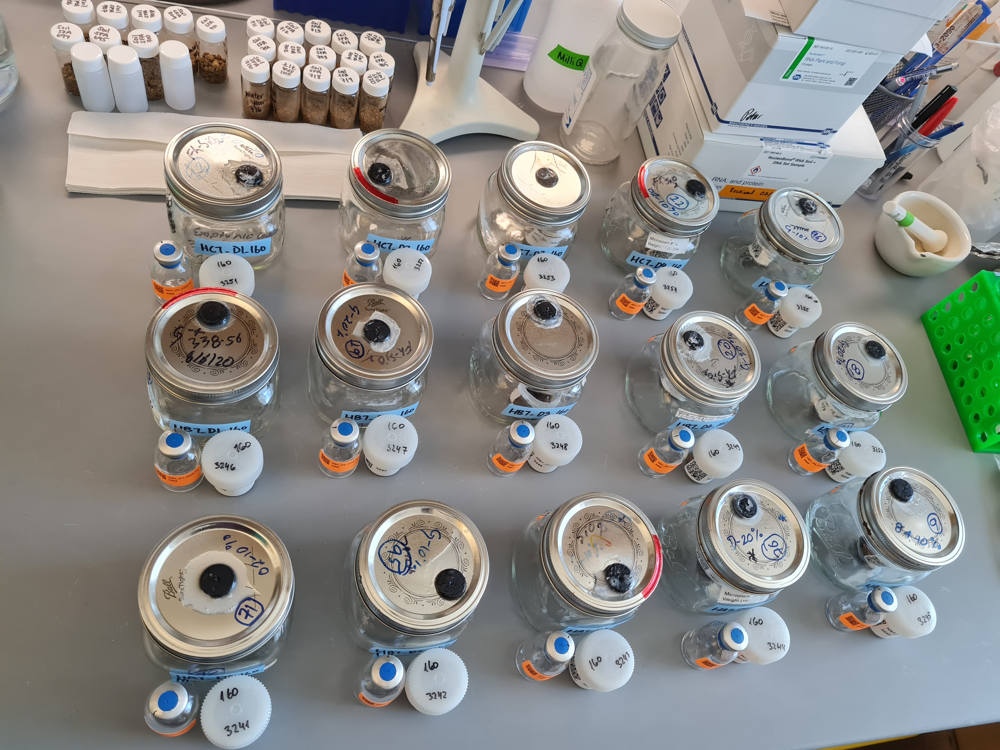

# Stable Isotope Probing Analysis

## Overview
This directory contains all data and analysis related to the stable isotope probing (SIP) experiment of the project. Soil incubations and DNA extractions were performed at UC Berekley by Petar Penev and Ka Ki Law, fractionation was performed in LLNL by George Michael Allen. qSIP scripts were written by Jeff Kimbrel.

The [data](./data) directory contains fractionation data, metadata extracted from [all_samples.csv](../all_samples.csv), and results from a test amplicon sequencing performed on deep samples from Angelo [data/sequencing/amplicon_2022](./data/sequencing/amplicon_2022/).

The [processing](./processing) directory contains scripts used to process the fractionation data and generate figures from the amplicon data.

The [scripts](./scripts) directory contains python scripts used to parse fractionation data, determine fraction binning, and plot figures of that. Additionally it contains an R script [qSIP.R](./scripts/qSIP.R) used to analyse the amplicon data. The file [vignette.html](./vignette.html) describes the analysis of the amplicon data.

The [figures](./figures) directory contains figures generated by the scripts.

## Incubation

## DNA extraction
See the [Extractions](../Extractions) directory for details.

## Fractionation
... To Do ...

## Sequencing
... To Do ...