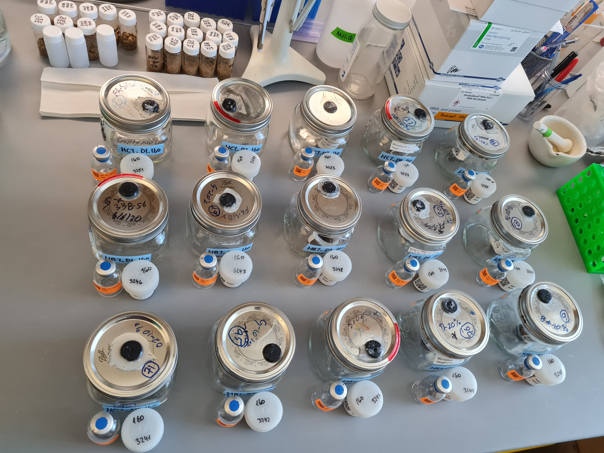
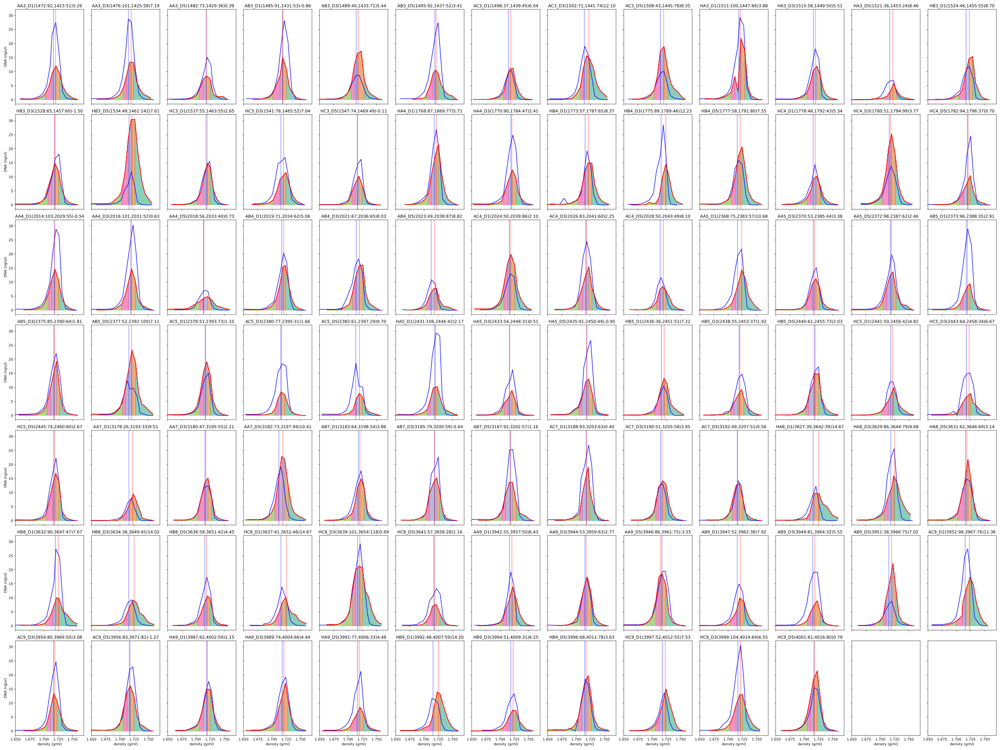

# Stable Isotope Probing Analysis

## Overview
This directory contains all data and analysis related to the stable isotope probing (SIP) experiment of the project. Soil incubations and DNA extractions were performed at UC Berekley by Petar Penev and Ka Ki Law, fractionation was performed in LLNL by George Michael Allen. qSIP scripts were written by Jeff Kimbrel.

The [data](./data) directory contains fractionation data, metadata extracted from [all_samples.csv](../all_samples.csv), and results from a test amplicon sequencing performed on deep samples from Angelo [data/sequencing/amplicon_2022](./data/sequencing/amplicon_2022/).

Furthermore it contains some [intermediate files](./data/fraction_bins/) generated by scripts for binning fractions and caulculating the average densities and concentrations of each fraction bin.

The [processing](./processing) directory contains scripts used to process the fractionation data and generate figures from the amplicon data.

The [scripts](./scripts) directory contains python scripts used to parse fractionation data, determine fraction binning, and plot figures of that. Additionally it contains an R script [qSIP.R](./scripts/qSIP.R) used to analyse the amplicon data. The file [vignette.html](./vignette.html) describes the analysis of the amplicon data.

The [figures](./figures) directory contains figures generated by the scripts.

## Incubation

## DNA extraction
See the [Extractions](../Extractions) directory for details.

## Fractionation
... To Do ...

## Fraction binning (Well merging)
The script [parseSIPoutput.py](./scripts/parseSIPoutput.py) was used to parse the fractionation data, use linear regression to identify sample fractions that didn't run properly, and adjust them. Furthermore, it outputs figures for comparing the atom fraction excess (AFE) of the different fractions [./figures/fractionation/](./figures/fractionation/).

Finally, the script performs a grouping of the fractions, based on user input of minimum DNA nanograms per grouped fraction and upper/lower density limits. It tries to ensure no overlaps across the entire project of fraction groups (e.g. the min density of group 1 across all samples is larger than the max density of group 2 across all samples and so on). Group 1 is the most dense and group 5 is the least dense. The output of those groupings is in [./data/fraction_bins/](./data/fraction_bins/).

## Sequencing
... To Do ...